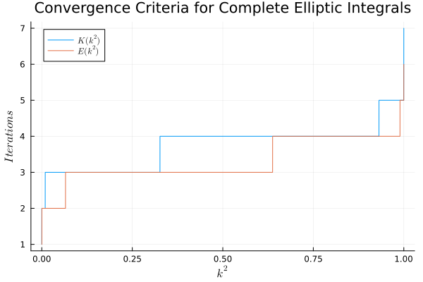

# Elliptic Integrals

## Background

For many numerical calculations, evaluation of the complete integrals of the
1st and 2nd kinds is a necessary but time-consuming process. They must be evaluated
numerically, which can be costly.  

Some background rules and requirements
- The task is to develop a time-optimal algorithm to evaluate both `K(k2)` and 
`E(k2)` simultaneously for an arbitrary N-length input vector of `k2`
- Performance will be measured against the `Scipy` implementations: [scipy.special.ellipk](https://docs.scipy.org/doc/scipy/reference/generated/scipy.special.ellipk.html) and [scipy.special.ellipe](https://docs.scipy.org/doc/scipy/reference/generated/scipy.special.ellipk.html)
- Target platform is both Apple M1 Pro (6 cores, 2021) (ARM NEON) and AMD Zen 5 9950X (16 cores, 2024) (x86-64)

## Complete Elliptic Integral of the First Kind

My reference implementation: 

```C
double ellipK(double k2) {

    if (fabs(k2 - 1.0) <= ERRMAX) return -1;

    int it = 1; 
    double err = 2*ERRMAX; 
    double a0 = 1.0; 
    double g0 = sqrt(1 - k2);
    double a1, g1;

    while ((it < ITMAX) && (err > ERRMAX)) {
        a1 = 0.5*(a0+g0); g1 = sqrt(a0*g0);
        a0 = a1; g0 = g1;
        err = fabs(a0 - g0); it += 1;
    }
    return pi/(2*a0);
}
```

### Reference Implementation Performance

On MacOS, compiled with:
```bash
gcc-14 -O3 -ffast-math -march=native ellipk.c -o test && ./test
```
The reference implementation solves in `5.1 ms` with the following settings:
- `N = 1e6`: number of values of `k2` 
- `ERRMAX = 1e-12`: acceptable numerical error in the output 

What's interesting is that at this max error level, all values of `k2` required on average `Nt=3.7` (`max(Nt)=6`) iterations of the loop to solve. What if we unrolled the loop explicitly and precomputed a few iterations before entering the loop?  



### Improved Implementation Performance 

After a lot of trial and error, I settled on this:

```C
double ellipKfast(double k2) {

    if (fabs(k2 - 1.0) <= ERRMAX) return 1e99;
    if (fabs(k2 - 0.0) <= ERRMAX) return 0.5*pi;

    int it = 1; 
    double err = 2*ERRMAX; 
    double a0 = 1.0; 
    double g0 = sqrt(1 - k2);
    double a1, g1;

    // 3 iterations 
    a1 = 0.5*(a0+g0); g1 = sqrt(a0*g0); a0 = a1; g0 = g1;
    a1 = 0.5*(a0+g0); g1 = sqrt(a0*g0); a0 = a1; g0 = g1;
    a1 = 0.5*(a0+g0); g1 = sqrt(a0*g0); a0 = a1; g0 = g1;

    err = fabs(a0 - g0);

    while ((err > ERRMAX) && it < ITMAX) {
        a1 = 0.5*(a0+g0); g1 = sqrt(a0*g0);
        a0 = a1; g0 = g1;
        err = fabs(a0 - g0); it += 1;
    }

    return pi/(2*a0);
}
```

Computing 3x iterations before entering the loop resulted in a ~`27%` speed improvement on this machine! 

Note that this result was dependent on a lot of factors:
- `ERRMAX`: if the error tolerance was lower, the performance gains were minimal, or the 'improved' version actually ran slower! This is likely because it was precomputing unnecessary iterations
- Number of precomputed iterations: I tried 1-5x iterations. I found that 4 resulted in lower gains, and 5 actually reduced the speed of the algorithm. 3 seemed optimal.
- Amount of `k2` values calculated: I benchmarked this for `N=10` to `N=1e6`. For 3 precomputed iterations, the performance increase was stable, but for other values, it increased or decreased. There's likely more to the story that I'm missing. 

| Precompute Iterations | Speedup | 
| -- | --- | 
| 1 | 2.3% (basically the same)|
| 2 | 5.89% | 
| 3 | 14.4% | 
| 4 | 17.54%| 
| 5 | 0% |

### Further Improvements - Blocking

Another thing I noticed while looking at the number of loop iterations is a bifurcation - 

### Conclusion 

This algorithm is fairly basic. Due to its iterative nature, it seems difficult to 
vectorize or apply other improvements at the moment. I'm happy with a +`27%` speedup!

## Complete Elliptic Integral of the Second Kind 
*In progress...*

## Complete Elliptic Integrals of the First and Second Kind (Solved Together)
*In progress...*